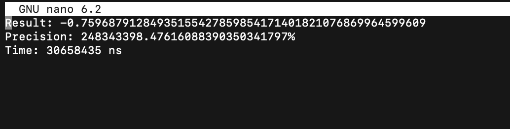

# avs_idz3

БПИ219 Талалаев Геннадий Алексеевич

Мой вариант 3 представлен ниже:


---
**Формат ввода:**
- Программа запускается через командую строку в формате:

```
./ans {a} {file.in (опционально)} {file.txt(опционально)}
```
- Вводится число a: 

1 -> генерируется рандомное число
```
./ans 1
```
2 -> входной параметр вводится следующим аргументом
```
./ans 2 -27
```
3 -> вводится два файла (входной и выходной). 
```
./ans 3 input.txt output.txt
```
---
**Формат вывода.**
Выводится 3 строки в формате:
```
Result: {результат}
Precision: {точность}
Time: {результат замера по времени для выполнения программы 1000 раз}
```
---
## 4 балла

 - В проекте это два файла p1.c и p2.c
---


- Компиляция без отладочных опций:


- После компиляции созданы файлы p1.s и p2.s, комментарии написаны в них.
---


- Использованы аргументы командой строки и ручное редактирование, получились файлы p1_v2.s и p2_v2.s.


---


- Программа скомпилирована и скомпонована без опций отладки


---


**Тесты (для всех трех программ)**


---


- Отчёт сформирован.
---
## 5 баллов


- Функции с передачей данных через параметры использованы (файл part2.c)

```
double factorial(double x) {
    double i = 1;
    while (x > 0) {
        i *= x;
        --x;
    }
    return i;
}
```

---


- Локальные переменные использованы. Это можно увидеть в файле part1.c
```
double val;
double result = 0;
double next;
double a = 0;
```
---

-   В ассемблерную программу при вызове функции добавлены комментарии, описывающие передачу фактических параметров и перенос возвращаемого результата. Это можно увидеть в файлах p1_v2.s и p2_v2.s
---

-    В функциях для формальных параметров добавлены комментарии, описывающие связь между параметрами языка Си и регистрами (стеком). Это можно увидеть в файлах p1_v2.s и p2_v2.s
---


- Информация добавлена в отчёт

## 6 баллов


- Произведёе рефакторинг программы за счёт максимального использования регистров. Это можно увидеть в файлах p1_v3.s и p2_v3.s

---

- Комментарии добавлены в файлы p1_v3.s и p2_v3.s

---

*Тест 1*

*Тест 2*

*Тест 3*

*Тест 4*

*Тест 5*

*Тест 6*

*Тест 7*

*Тест 8*

*Тест 9*

*Тест 10*

---
- Вес файла p1.s - 7 164  Б.
- Вес файла p1_v3.s - 5 653 Б.
- Вес файла p2.s - 1 103 Б.
- Вес файла p2_v3.s - 851 Б.
---

- Информация добавлена в отчёт.

## 7 баллов

- Выполнена реализация программы на ассемблере в виде двух единиц компиляции (так же разделена программа на C)
```
gcc -Os -masm=intel -fno-asynchronous-unwind-tables -fno-jump-tables -fno-stack-protector -fno-exceptions part1_e.c -S -Wno-unused-result -o ./p1_v3.s

gcc -Os -masm=intel -fno-asynchronous-unwind-tables -fno-jump-tables -fno-stack-protector -fno-exceptions part2_e.c -S -Wno-unused-result -o ./p2_v3.s

gcc p1_v3.s -c -o p1_v3.o

gcc p2_v3.s -c -o p2_v3.o

gcc ./p2_v3.o p1_v3.o ans3 -lm

```
---

- Для ввода/вывода результата из файла необходимо ввести:
```
./ans 3 {path to input file} {path to output file}
```
- Командная строка проверяет корректность, если что-то пойдёт не так - результат будет "Invalid input" и программа завершит выполнение.
---
 input.txt = {15}
*Тест 1*

*Output1*

*Output2*

*Output3*

---

- Добавлена возможность ввода/вывода из файла
- Формат входных файлов input.txt
- Формат выходных файлов output.txt

## 8 баллов

- Добавлен генератор случайных чисел
```
double randomValue() {
    srand(time(NULL));
    return -100 + (double) rand() / RAND_MAX * (115);
}
```
---

- Есть 3 типа ввода: из файла, из командой строки, рандомые входные данные
1) Рандомные входные данные
```
./ans 1
```
2) Входные данные из командой строки
```
./ans 2 
27
```
3) Входные данные из файла и вывод результата в файл
```
./ans 3 test.txt out.txt
```
---

- Добавлены функции замера времени, это можно увидеть в файле p1.c:
```
struct timespec start;
struct timespec end;
clock_gettime(CLOCK_MONOTONIC, &start);
(Работа программы без ввода/вывода в цикле на 1000 повторений) 
clock_gettime(CLOCK_MONOTONIC, &end);
long long result_time = end.tv_sec * 10e8 + end.tv_nsec - start.tv_sec * 10e8 - start.tv_nsec;
```
---

- Тесты замеры времени

